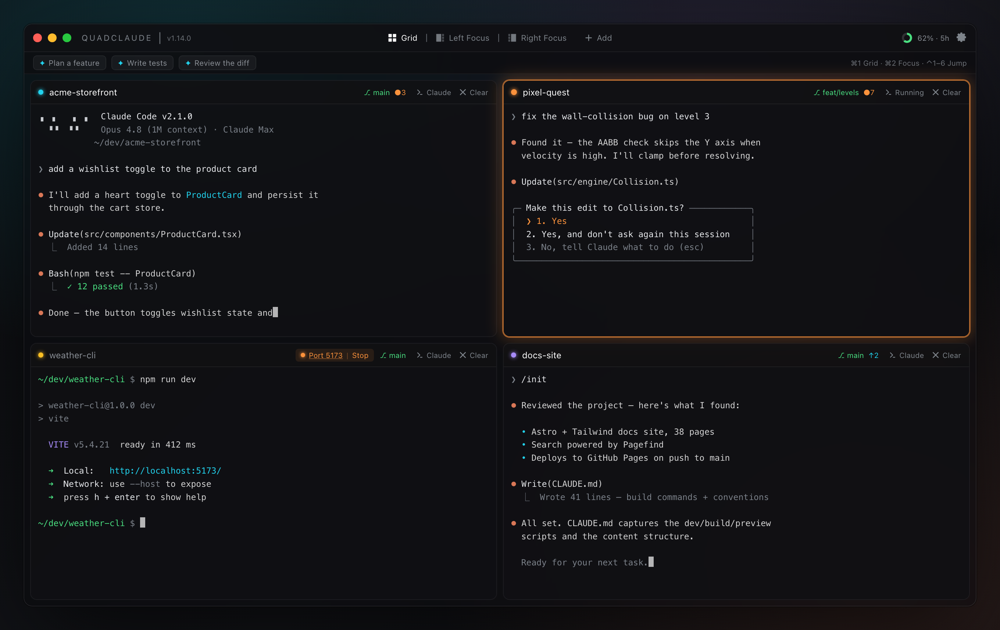

# QuadClaude

The ADHD workspace for Claude Code — run up to 6 Claude sessions side by side with flexible layouts and a glass-effect UI. Six sessions, zero impulse control.



<sub>Illustrative mockup with placeholder projects. Source: [`docs/screenshot-mock.html`](docs/screenshot-mock.html).</sub>

## Features

- **4–6 Independent Terminals**: Run separate Claude sessions in each pane; add or close extra panes beyond the core four (up to 6)
- **Custom Agents (Bring Your Own Model)**: Launch any CLI agent (Claude Code, opencode, aider, …) against your own OpenAI-compatible endpoint — one agent per pane, chosen from the model badge
- **Pane Pairing**: Link two panes as an orchestrator ⇄ worker team (e.g. Claude plans, a local model grinds) with a shared-color ring and role chips
- **3 Layout Modes**: Grid (auto-balanced), Focus (1 large + rest small), Focus-Right (rest small + 1 large)
- **Glass UI**: macOS Liquid Glass visual effects with dark-mode-only design
- **Prompt Library**: Save and recall frequently used prompts via a floating toolbar
- **Usage Tracking**: Real-time Claude API usage indicator in the title bar
- **Custom Wallpapers**: Set background wallpapers with adjustable opacity
- **Favorite Directories**: Star directories for quick access across terminals
- **Git Status Bar**: Shows branch name and ahead/behind counts on every terminal
- **Auto-Named Terminals**: Headers show folder/repo name automatically
- **Workspace Persistence**: Remembers your directories, layout, and preferences between sessions
- **Drag & Drop Reordering**: Rearrange terminal positions by dragging headers

## Bring Your Own Model (Custom Agents)

Each pane can launch any CLI coding agent — not just Claude Code — so you can mix Claude with a local or self-hosted model and run them side by side. QuadClaude is a **pure launcher**: it runs a command with a set of env vars in a terminal and never speaks any API itself, so it works with any tool and any provider.

Add an agent in **Settings → Agents → Add agent**. A profile is just a **name**, a **command**, and an optional set of **environment variables**. Pick a preset (opencode / aider) or **Other** for anything else. The model badge in each pane header shows and switches the agent; the default agent is used for new panes.

Tools configure themselves in one of two ways — the presets reflect both:

- **Env-driven tools (e.g. aider)** — set the variables right in the profile:
  - `OPENAI_API_BASE` = `http://your-host/v1`
  - `OPENAI_API_KEY` = your key (any placeholder like `ollama` for local models that don't check it)
- **Config-file tools (e.g. opencode)** — leave the env empty and configure the tool itself. For opencode, edit `~/.config/opencode/opencode.json`:

  ```json
  {
    "$schema": "https://opencode.ai/config.json",
    "provider": {
      "my-local": {
        "npm": "@ai-sdk/openai-compatible",
        "name": "My Local Model",
        "options": { "baseURL": "http://your-host/v1", "apiKey": "ollama" },
        "models": { "your-model-id": { "name": "Your Model" } }
      }
    }
  }
  ```

API keys set in a profile are injected into the agent's shell at launch and never echoed into shell history.

> **Reaching a self-hosted endpoint.** Your tool runs on *your* machine, so the endpoint must be reachable from it. Local models (`http://localhost:11434/v1` for Ollama) just work. For a remote/self-hosted box, make sure the URL resolves and isn't gated behind browser SSO — a private VPN (e.g. Tailscale, or an Olares LarePass VPN to an internal entrance) is the cleanest way. Quick check: `curl http://your-host/v1/models` should return a JSON model list (HTTP 200), not a redirect.

## Installation

### Prerequisites

- Node.js 18+
- npm or yarn
- macOS (Liquid Glass requires macOS)
- Claude CLI installed and authenticated (`claude` command available)

### From Release

Download the latest `.dmg` from the [Releases](https://github.com/rdyplayerB/QuadClaude/releases) page.

### Development

```bash
# Clone the repository
git clone https://github.com/rdyplayerB/QuadClaude.git
cd QuadClaude

# Install dependencies
npm install

# Start development server
npm run electron:dev
```

### Build

```bash
# Build for production
npm run build
```

The packaged app will be in the `release` directory.

## Usage

### Layouts

| Layout | Shortcut | Description |
|--------|----------|-------------|
| Grid | `Cmd+1` | 2x2 equal quadrants |
| Focus | `Cmd+2` | 1 large pane on left + 3 small on right |
| Focus-Right | `Cmd+3` | 3 small panes on left + 1 large on right |

**Tip**: Double-click any terminal header to toggle focus mode on that pane.

### Navigation

| Action | Shortcut |
|--------|----------|
| Focus Terminal 1-4 | `Cmd+Shift+1-4` |
| Clear Current Terminal | `Cmd+K` |
| Increase Font | `Cmd++` |
| Decrease Font | `Cmd+-` |

### Terminal Lifecycle

1. Each pane starts as a standard shell (bash/zsh)
2. Navigate to your project directory with `cd`
3. Run `claude` to start a Claude session
4. When Claude exits, the pane returns to a shell in the same directory

### Prompt Library

Save frequently used prompts and inject them into any terminal with one click.

- Click the **+** button on the floating toolbar to create a prompt
- Click a saved prompt to inject its text into the active terminal
- Right-click a prompt to delete it

### Git Status Bar

Each terminal displays a compact status bar showing:
- Git branch name (when in a git repo)
- Commits ahead/behind remote

### Workspace Persistence

Your workspace state is automatically saved and restored:
- Terminal working directories
- Current layout mode
- Active pane selection
- Saved prompts and favorite directories
- Background/wallpaper settings

## Project Structure

```
src/
├── main/              # Electron main process
│   ├── index.ts       # App entry, window management, Liquid Glass
│   ├── pty.ts         # PTY process management + git status caching
│   ├── usage.ts       # Claude API usage polling
│   ├── preload.ts     # Preload script for IPC
│   └── workspace.ts   # State persistence
├── renderer/          # React UI
│   ├── App.tsx
│   ├── components/
│   │   ├── TerminalPane.tsx
│   │   ├── TerminalGrid.tsx
│   │   ├── PaneHeader.tsx
│   │   ├── PromptToolbar.tsx
│   │   ├── UsageIndicator.tsx
│   │   ├── FavoritesDropdown.tsx
│   │   ├── LayoutSelector.tsx
│   │   └── SettingsModal.tsx
│   ├── hooks/
│   ├── layouts/
│   └── store/
└── shared/            # Shared types
```

## Tech Stack

- Electron 41
- React 18 + TypeScript
- xterm.js + node-pty
- Zustand (state management)
- Tailwind CSS
- Vite
- electron-liquid-glass

## Acknowledgments

- [Claude-Usage-Tracker](https://github.com/hamed-elfayome/Claude-Usage-Tracker) by [@hamed-elfayome](https://github.com/hamed-elfayome) - the statusline script is adapted from this project; powers Claude Code statusline integration and usage tracking
- [electron-liquid-glass](https://github.com/Meridius-Labs/electron-liquid-glass) by [Meridius Labs](https://github.com/Meridius-Labs) - macOS Liquid Glass window effects behind QuadClaude's glass UI

Built on [xterm.js](https://github.com/xtermjs/xterm.js), [node-pty](https://github.com/microsoft/node-pty), [Electron](https://www.electronjs.org/), [React](https://react.dev/), and [Zustand](https://github.com/pmndrs/zustand).

## License

QuadClaude — Copyright (C) 2026 rdyplayerB

Licensed under the [GNU AGPL v3.0](LICENSE) or later — if you run a modified version of QuadClaude over a network, you must make your source available to its users.

## Trademarks

QuadClaude is an independent, community project. It is not affiliated with, endorsed by, or sponsored by Anthropic. "Claude" and "Anthropic" are trademarks of Anthropic PBC. QuadClaude uses the name only to describe its interoperability with Anthropic's Claude products.
