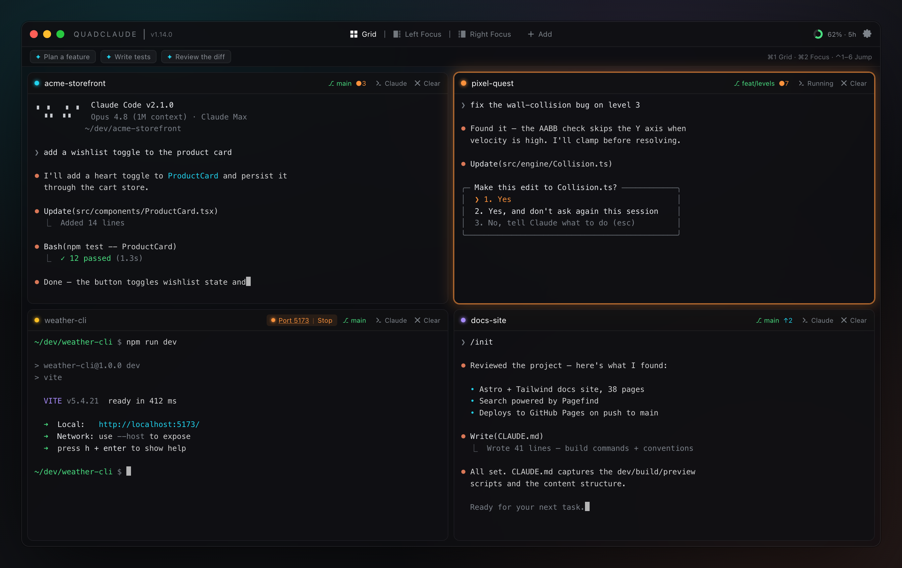

# QuadClaude

**The Claude Code client for the ADHD brain.** Run up to 12 Claude sessions side by side in one glass window — because an agent you can't see is an agent you forgot about. A dozen sessions, zero impulse control.

[](https://github.com/rdyplayerB/QuadClaude/releases)

[](LICENSE)



<sub>Real app screenshot — the four panes show demo projects with simulated session output.</sub>

## Why QuadClaude

Claude Code made it easy to run five agents at once. Your terminal made it easy to forget four of them exist.

QuadClaude is built around one rule: **out of sight is out of mind.** Nothing lives in a tab, nothing hides behind another window — every session stays on screen with its state readable at a glance.

- **Everything visible, always.** Agents don't get buried. The grid is the whole app.
- **One glance, total state.** Every pane shows its repo, branch, ahead/behind counts, and whether Claude is working or waiting on you.
- **Interrupt-proof.** Wander off mid-task and the grid shows exactly where you left things when you come back. Quit the app and the whole workspace restores itself.
- **Hyperfocus on tap.** Focus layouts make one pane huge while the rest stay in the corner of your eye. Double-click a header to dive in, double-click to surface.

## Features

- **4–12 Independent Terminals**: Run separate Claude sessions in each pane; add or close extra panes beyond the core four (up to 12)
- **Activity Console**: A live ops view of every pane — who's working, what tool call is in flight, what landed, and what's blocked on you — built from real session transcripts, not guesses
- **Run Any Model as Claude Code**: Drive the *real* Claude Code TUI with any non-Anthropic model (OpenRouter, DeepSeek, any OpenAI-compatible API) — identical look, identical behavior (applies edits instead of dumping code). Add it from a one-screen wizard.
- **Delegation + Dashboard**: Hand bulk work to a cheaper model with `qcdelegate`, and see every keep/delegate decision, worker diff, and ground-truth check result in a dedicated dashboard
- **Per-Pane Claude Accounts**: Bind panes to different Claude subscriptions and run two accounts side by side, each with its own usage readout
- **Custom Agents (Bring Your Own Model)**: Launch any CLI agent (Claude Code, opencode, aider, …) against your own OpenAI-compatible endpoint — one agent per pane, chosen from the model badge
- **Pane Pairing**: Link two panes as an orchestrator ⇄ worker team (e.g. Claude plans, a local model grinds) with a shared-color ring and role chips
- **5 Layout Modes**: Grid, Focus, Focus-Right, Duo, and Solo — with a floating picture-in-picture strip holding whatever the layout hides
- **Per-Pane Port Isolation**: Dev servers in different panes stop fighting over port 3000, by loopback IP or by port offset
- **Glass UI**: macOS Liquid Glass visual effects with dark-mode-only design
- **Prompt Library**: Save and recall frequently used prompts via a floating toolbar
- **Usage Tracking**: Real-time Claude usage indicator in the title bar, with sampled history of your subscription utilization
- **Custom Wallpapers**: Set background wallpapers with adjustable opacity
- **Favorite Directories**: Star directories for quick access across terminals
- **Git Status Bar**: Shows branch name and ahead/behind counts on every terminal
- **Auto-Named Terminals**: Headers show folder/repo name automatically
- **Workspace Persistence**: Remembers your directories, layout, and preferences between sessions
- **Drag & Drop Reordering**: Rearrange terminal positions by dragging headers

## Activity Console


Twelve panes is more state than a grid of terminals can honestly show. The **Activity Console** (`Cmd+Shift+A`, or **View → Activity Console**) is a second read on the same workspace: not another terminal, but a board of what every agent is *doing*.

It has three parts:

- **Agent roster** — one row per pane: state, model, account, branch, context used, and an output meter showing real tokens produced per 2-second bucket. A flat meter means the agent produced nothing, which is different from being idle.
- **Activity board** — work flows left to right through six lanes: `queued → thinking → acting → returned → landed`, plus a narrow `blocked` rail. A card is **carried** between lanes rather than destroyed and recreated, so what you watch is one piece of work travelling. `landed` shows the *outcome* — what Claude said when it finished, with the turn's real duration and diff.
- **Activity feed** — the same events as history, newest first, with incidents called out.

Everything on a card is read from the session transcript: real `tool_use → tool_result` durations, real `output_tokens`, Claude's own sentence about the call. Token totals are deduped by message id and validated against [ccusage](https://github.com/ryoppippi/ccusage) — a naive sum runs about 2.5× high because the transcript records each streamed response several times.

Subagents are grouped: one card per parent agent listing each fork and its own clock, so an agent that spawns eight forks costs one card, not eight.

The console renders natively inside the main window (a Shadow DOM overlay, ~2 MB) rather than as a second browser window (~99 MB). Settings → Plugins controls its refresh rate, whether it opens at launch, and an optional verification mode that measures how accurately the board mirrors real pane transitions.

## Run Any Model as Claude Code

Want a non-Claude model that still *looks and behaves 100% like Claude Code* — same `⏺` tool bullets, same diffs, same todo lists, and crucially the same behavior (it **applies edits** and gives a tight summary instead of dumping walls of code)? QuadClaude can run the **genuine `claude` CLI** against any hosted model.

It works because the look/feel comes from Claude Code itself, not from QuadClaude. So instead of restyling another tool's output, QuadClaude runs the real client and routes its API calls to your model through [claude-code-router](https://github.com/musistudio/claude-code-router):

```
pane → real `claude` TUI → claude-code-router (local) → your hosted API (OpenRouter / DeepSeek / …)
```

**Setup (one screen):**

1. Install the router once, in any pane: `npm install -g @musistudio/claude-code-router`
2. Open **Settings → Run any model as Claude Code → Add a model**.
3. Pick a provider preset (OpenRouter, DeepSeek, OpenAI-compatible, or Custom), paste your **base URL**, **API key**, and **model id**, give it a name, and hit **Test connection** → **Save model**.
4. A new **“Claude Code · <your model>”** agent appears. Pick it on any pane from the model badge — that pane is now Claude Code, powered by your model.

Add as many models as you like and run them in different panes simultaneously. Your API key is written only to claude-code-router's local config (`~/.claude-code-router/config.json`, `chmod 600`) — never to the cloud, never echoed into shell history.

QuadClaude keeps the router alive for you with a launchd keeper, so a router that dies is back in about 300 ms instead of breaking your next delegation.

> **How close to 100%?** The TUI is *literally* Claude Code, so it's indistinguishable visually. The only real tells are the model's own intelligence/speed and the occasional self-identity slip (a model saying "I'm Qwen"). Everything QuadClaude controls is identical.

## Delegation: offload bulk work to a cheaper model

Once you've added a model, you can use it as a **delegation worker** — let your main Claude (the orchestrator) hand off grunt work (boilerplate, repetitive edits, scaffolding) to a cheaper model, saving your budget for planning and review.

In **Settings → Models → Delegation**, pick which configured model handles delegation. QuadClaude installs a set of commands into `~/.local/bin` that target whatever model you chose — nothing is hardcoded, and switching the model repoints them without reinstalling.

| Command | What it does |
|---------|--------------|
| `qcdelegate "<task>"` | Runs the task on the worker model, applying edits in the current directory. Logs the prompt, the resulting diff, route, duration, and — with `QC_CHECK` set — whether your test/lint/build command passed. |
| `qcdecide "<unit>" keep\|delegate "<why>"` | Records the keep/delegate call *before* acting on a unit of work, so the split is visible while it happens rather than reconstructed later. |
| `qctrace decision\|eval\|cost …` | The telemetry loop: what was decided, whether the worker's diff passed review, and roughly what the orchestrator spent on spec + review. |
| `qceval` / `qclearn` | A continuously-learning evaluator with durable memory in `~/.quadclaude/eval` — it survives app updates and reinstalls. |
| `qcshadow` | Counterfactual test: would the worker have matched a unit you *kept*? Runs it in an isolated worktree, checks it, and judges the result — measuring over-caution. |
| `qcdoctor` | One-shot health check of the whole pipeline: toggle, model, PATH, router reachability, engine, eval memory. |

**Watching it happen.** Add a **Live feed** pane in one click to tail `~/.quadclaude/delegation.log`, and scope that pane to a single orchestrator session when several are running at once.

**Ground truth.** Attach a check to every delegation and the result is objective rather than self-reported:

```bash
QC_TASK=parser-fix QC_CHECK="npm test -- parser" qcdelegate "make the parser accept trailing commas"
```

Worker diffs are reviewed by an **adversarial multi-judge verifier** — a skeptic panel over the diff, rather than a single pass that tends to agree with itself.

> The delegation engine defaults to [aider](https://github.com/Aider-AI/aider), which self-verifies and is meaningfully faster than a full Claude Code run for mechanical work. It needs your endpoint to be reachable: a fail-fast preflight tells you the VPN is down instead of letting the request fail as unparseable HTML.

### Delegation dashboard


The dashboard (title-bar button) is the analyst view of that telemetry — a briefing over a ledger, not a log viewer:

- **Computed verdict** at the top: is delegating actually working, per class of work?
- **Decisions rail** — every `qcdecide` call, filterable by project, so you can see what you keep sending to the worker and what you always keep for yourself.
- **Calls** — each delegation with its real prompt (on demand), diff, duration, and whether its `QC_CHECK` passed. Failed checks are explained rather than just flagged, and the Issues KPI jumps straight to the problem call.
- **Shadow bands** — inline results from `qcshadow`, showing where a KEEP was over-cautious.
- **Freshness heartbeat** so you can tell live logging from a stale window.

## Bring Your Own Model (Custom Agents)

> The section above is the turnkey path. This one is the **raw launcher** — use it when you'd rather run a tool's own UI (opencode, aider) instead of the Claude Code TUI.

Each pane can launch any CLI coding agent — not just Claude Code — so you can mix Claude with a local or self-hosted model and run them side by side. QuadClaude is a **pure launcher**: it runs a command with a set of env vars in a terminal and never speaks any API itself, so it works with any tool and any provider.

Add an agent in **Settings → Agents → Add agent**. A profile is just a **name**, a **command**, and an optional set of **environment variables**. Pick a preset (opencode / aider) or **Other** for anything else. The model badge in each pane header shows and switches the agent; the default agent is used for new panes.

Tools configure themselves in one of two ways — the presets reflect both:

- **Env-driven tools (e.g. aider)** — set the variables right in the profile:
  - `OPENAI_API_BASE` = `http://your-host/v1`
  - `OPENAI_API_KEY` = your key (any placeholder like `ollama` for local models that don't check it)
- **Config-file tools (e.g. opencode)** — leave the env empty and configure the tool itself. For opencode, edit `~/.config/opencode/opencode.json`:

  ```json
  {
    "$schema": "https://opencode.ai/config.json",
    "provider": {
      "my-local": {
        "npm": "@ai-sdk/openai-compatible",
        "name": "My Local Model",
        "options": { "baseURL": "http://your-host/v1", "apiKey": "ollama" },
        "models": { "your-model-id": { "name": "Your Model" } }
      }
    }
  }
  ```

API keys set in a profile are injected into the agent's shell at launch and never echoed into shell history.

> **Reaching a self-hosted endpoint.** Your tool runs on *your* machine, so the endpoint must be reachable from it. Local models (`http://localhost:11434/v1` for Ollama) just work. For a remote/self-hosted box, make sure the URL resolves and isn't gated behind browser SSO — a private VPN (e.g. Tailscale, or an Olares LarePass VPN to an internal entrance) is the cleanest way. Quick check: `curl http://your-host/v1/models` should return a JSON model list (HTTP 200), not a redirect.

## Two Claude accounts, side by side

Panes can be bound to different Claude accounts, so a work subscription and a personal one run in the same window without logging in and out. Each pane header shows which account it's on, and the usage indicator refreshes when you switch — the title bar reports the account you're actually looking at.

## Installation

### Prerequisites

- Node.js 18+
- npm or yarn
- macOS (Liquid Glass requires macOS)
- Claude CLI installed and authenticated (`claude` command available)

### From Release

Download the latest `.dmg` from the [Releases](https://github.com/rdyplayerB/QuadClaude/releases) page.

### Development

```bash
# Clone the repository
git clone https://github.com/rdyplayerB/QuadClaude.git
cd QuadClaude

# Install dependencies
npm install

# Start development server
npm run electron:dev
```

### Build

```bash
# Build for production
npm run build
```

The packaged app will be in the `release` directory.

## Usage

### Layouts

| Layout | Shortcut | Description |
|--------|----------|-------------|
| Grid | `Cmd+1` | Auto-balanced grid — 2×2 with four panes, up to 4×3 with twelve |
| Focus | `Cmd+2` | 1 large pane on left + the rest small on the right |
| Focus-Right | `Cmd+3` | Small panes on left + 1 large on the right |
| Duo | `Cmd+4` | Two panes side by side, with a draggable divider |
| Solo | `Cmd+5` | One pane fullscreen |

In Duo and Solo, the panes the layout hides move into a floating **picture-in-picture strip** — live, not paused — so nothing disappears. Toggle it with `Cmd+B`, drag its header to any corner, and `Ctrl+Tab` cycles the next pane into the main view.

**Tip**: Double-click any terminal header to toggle focus mode on that pane.

### Navigation

| Action | Shortcut |
|--------|----------|
| Focus Terminal 1–9 | `Ctrl+1-9` (1–4 rebindable in Settings; 5–9 fixed) |
| Activity Console | `Cmd+Shift+A` |
| Launch Claude in the current pane | `Cmd+L` |
| Clear Current Terminal | `Cmd+K` |
| Reset a stuck pane | `Cmd+Shift+K` |
| Increase / Decrease Font | `Cmd++` / `Cmd+-` |
| Increase / Decrease UI Size | `Cmd+Shift++` / `Cmd+Shift+-` |

### Terminal Lifecycle

1. Each pane starts as a standard shell (bash/zsh)
2. Navigate to your project directory with `cd`
3. Run `claude` (or press `Cmd+L`) to start a Claude session
4. When Claude exits, the pane returns to a shell in the same directory

Pane headers distinguish *Claude is running* from *Claude is working*: a pane that is generating, a pane whose turn is over and awaiting instruction, and a pane blocked on a permission prompt are three different states, shown differently. If a pane ever goes unresponsive — selectable but refusing input — **Reset Current Pane** (`Cmd+Shift+K`) fully resets the terminal.

### Prompt Library

Save frequently used prompts and inject them into any terminal with one click.

- Click the **+** button on the floating toolbar to create a prompt
- Click a saved prompt to inject its text into the active terminal
- Right-click a prompt to delete it

### Git Status Bar

Each terminal displays a compact status bar showing:
- Git branch name (when in a git repo)
- Commits ahead/behind remote

### Port isolation

Running several dev servers at once means several things want port 3000. **Settings → Port isolation** gives each pane either its own loopback IP (`127.0.0.2`, `127.0.0.3`, … — same port stays free) or its own port offset. Frameworks that honor `HOST`/`PORT` pick it up automatically.

### Plugins

The Activity Console is a plugin, and the plugin host is generic: a plugin declares its id, menu item, capabilities (`read:workspace`, `read:transcripts`, `read:telemetry`, …) and settings in a manifest, and the app wires up its menu entry, preferences, and lifecycle. **Settings → Plugins** enables them and edits their settings.

### Workspace Persistence

Your workspace state is automatically saved and restored:
- Terminal working directories
- Current layout mode, PiP position, and splitter ratios
- Active pane selection
- Saved prompts and favorite directories
- Background/wallpaper settings
- Agent, account, and plugin preferences

## Project Structure

```
src/
├── main/              # Electron main process
│   ├── index.ts       # App entry, window management, Liquid Glass
│   ├── ipc.ts         # IPC handler registration
│   ├── menu.ts        # Application menu (incl. plugin-contributed items)
│   ├── pty.ts         # PTY process management + git status caching
│   ├── usage.ts       # Claude usage polling
│   ├── accountStore.ts# Per-pane Claude accounts
│   ├── router.ts      # claude-code-router config + keeper
│   ├── statusline.ts  # Statusline script install
│   ├── delegationLog.ts # Delegation feed + telemetry tail
│   ├── loopback.ts    # Per-pane port isolation
│   ├── pluginHost.ts  # Generic plugin lifecycle + capabilities
│   ├── preload.ts     # Preload script for IPC
│   └── workspace.ts   # State persistence
├── plugins/
│   └── ops-console/   # Activity Console (manifest, service, view)
│       ├── main/      # transcript tailer, token meter, snapshot service
│       └── opsview.ts # the console UI, mounted into a Shadow DOM host
├── renderer/          # React UI
│   ├── App.tsx
│   ├── components/    # TerminalPane, PaneHeader, PipStrip, OpsOverlay,
│   │   └── ui/        # DelegationDashboard, Settings panels, shared UI
│   ├── hooks/
│   ├── layouts/
│   ├── store/
│   └── util/
└── shared/            # Shared types + plugin contract
```

## Tech Stack

- Electron 41
- React 18 + TypeScript
- xterm.js + node-pty
- Zustand (state management)
- Tailwind CSS
- Vite
- electron-liquid-glass

## Acknowledgments

- [Claude-Usage-Tracker](https://github.com/hamed-elfayome/Claude-Usage-Tracker) by [@hamed-elfayome](https://github.com/hamed-elfayome) - the statusline script is adapted from this project; powers Claude Code statusline integration and usage tracking
- [electron-liquid-glass](https://github.com/Meridius-Labs/electron-liquid-glass) by [Meridius Labs](https://github.com/Meridius-Labs) - macOS Liquid Glass window effects behind QuadClaude's glass UI

Built on [xterm.js](https://github.com/xtermjs/xterm.js), [node-pty](https://github.com/microsoft/node-pty), [Electron](https://www.electronjs.org/), [React](https://react.dev/), and [Zustand](https://github.com/pmndrs/zustand).

## License

QuadClaude — Copyright (C) 2026 rdyplayerB

Licensed under the [GNU AGPL v3.0](LICENSE) or later — if you run a modified version of QuadClaude over a network, you must make your source available to its users.

## Trademarks

QuadClaude is an independent, community project. It is not affiliated with, endorsed by, or sponsored by Anthropic. "Claude" and "Anthropic" are trademarks of Anthropic PBC. QuadClaude uses the name only to describe its interoperability with Anthropic's Claude products.
